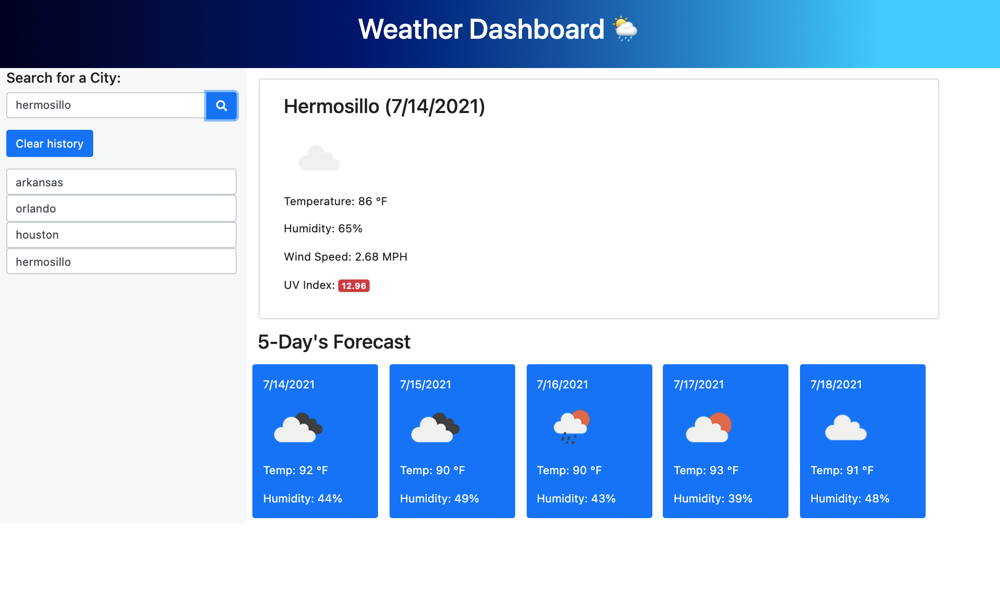

# Unit 06 - Server-Side APIs: Weather Dashboard

## Project
This project consists on working with Third-Party APIs. This type of APIs allow us to access their data and functionality by making requests with specific parameters to a URL. 

The challenge of this project is to build a weather dashboard that will run in the browser and feature dynamically updated HTML and CSS.

I am using the [OpenWeather One Call API](https://openweathermap.org/api/one-call-api) to retrieve weather data for cities, and `localStorage` to store any persistent data.


## User Story

```
AS A traveler
I WANT to see the weather outlook for multiple cities
SO THAT I can plan a trip accordingly
```

## Acceptance Criteria

```
GIVEN a weather dashboard with form inputs
WHEN I search for a city
THEN I am presented with current and future conditions for that city and that city is added to the search history
WHEN I view current weather conditions for that city
THEN I am presented with the city name, the date, an icon representation of weather conditions, the temperature, the humidity, the wind speed, and the UV index
WHEN I view the UV index
THEN I am presented with a color that indicates whether the conditions are favorable, moderate, or severe
WHEN I view future weather conditions for that city
THEN I am presented with a 5-day forecast that displays the date, an icon representation of weather conditions, the temperature, the wind speed, and the humidity
WHEN I click on a city in the search history
THEN I am again presented with current and future conditions for that city
```


## Mock-Up

The following image shows the web application's appearance and functionality:





## URL of deployment

Link: <a href="https://navena9.github.io/06-Weather-Dashboard/" target="_blank">URL to App</a>


## Technologies

* Open Weather API
* JQuery
* javaScript
* Bootstrap


## Contributor

Nicolas Cedano Avena
- - -
© 2021 Trilogy Education Services, LLC, a 2U, Inc. brand. Confidential and Proprietary. All Rights Reserved.
